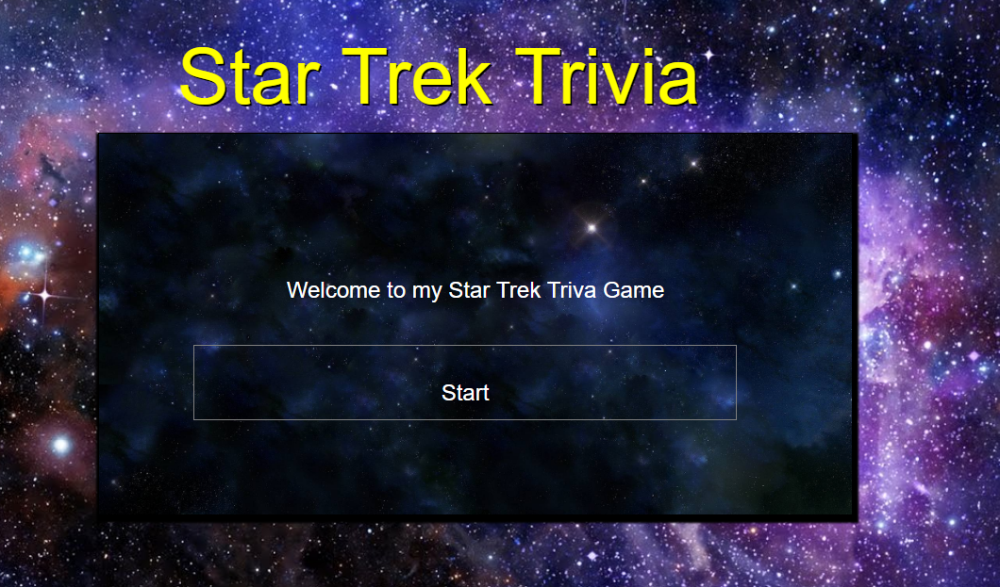

# Star Trek Trivia
A Trivia game using JavaScript for the logic and jQuery to manipulate HTML. 
Layout for the app was done with valid HTML and stylish CSS.

 * It's a trivia game that shows only one question until the player answers it or their time runs out.
  * If the player selects an answer, the game tells them if they are correct or not. 
   * After a few seconds,the game displays the next question -- without user input.

* If the player runs out of time, the game tells the player that time's up and displays the correct answer. 
   Waits a few seconds, then shows the next question.
* If the player chooses the wrong answer, the game tells the player they selected the wrong option and
then displays the correct answer. Waits a few seconds, then shows the next question.

* On the final screen, the game shows the number of correct answers, incorrect answers, 
and an option to restart the game (without reloading the page).

* The player will have a limited amount of time to finish the quiz. 

* The game ends when the time runs out. The page will reveal the number of questions 
that players answer correctly and incorrectly.

 

 [Link to application](https://cpaul319.github.io/Trivia_Game/)

